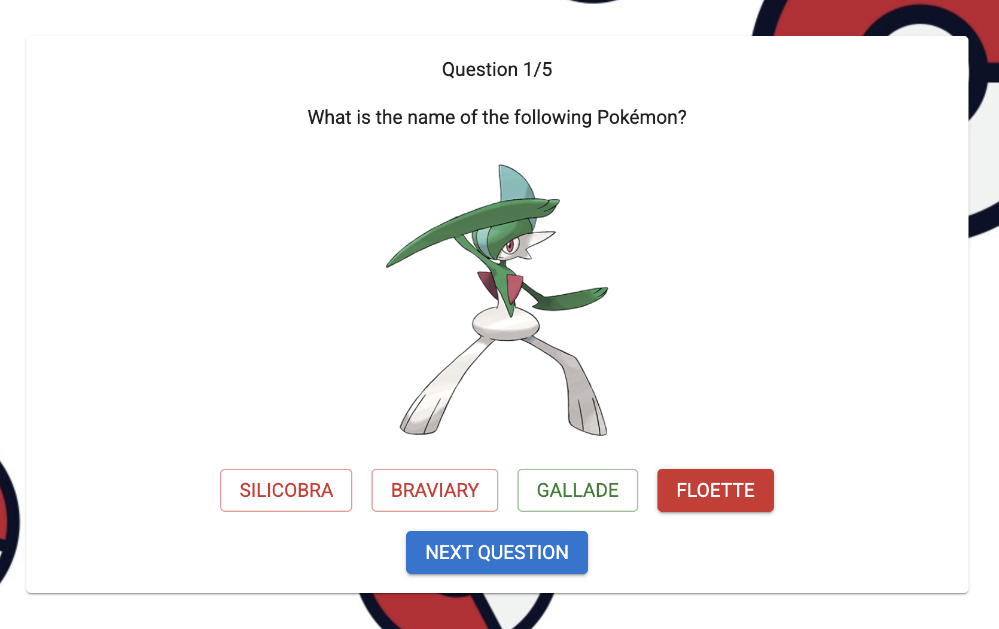

<a id="readme-top"></a>
<br />

<div align="center">
  <a href="https://github.com/csvlewis/pokemon-quiz">
    
  </a>

<h3 align="center">Pokémon Quiz</h3>

  <p align="center">
    A Pokémon quiz app built using the <a href="https://github.com/PokeAPI/pokedex-promise-v2">Pokémon API</a> to generate questions
  </p>
</div>

<details>
  <summary>Table of Contents</summary>
  <ol>
    <li>
      <a href="#about-the-project">About The Project</a>
      <ul>
        <li><a href="#built-with">Built With</a></li>
      </ul>
    </li>
    <li>
      <a href="#getting-started">Getting Started</a>
      <ul>
        <li><a href="#prerequisites">Prerequisites</a></li>
        <li><a href="#installation">Installation</a></li>
      </ul>
    </li>
    <li><a href="#usage">Usage</a></li>
    <li><a href="#testing">Testing</a></li>
    <li><a href="#potential-features">Potential Features</a></li>
    <li><a href="#contact">Contact</a></li>
  </ol>
</details>

## About The Project

This project is a Pokémon quiz app built using Next.js. The quiz question data is generated by fetching random Pokémon data from the [Pokémon API][PokeAPI-url]. That Pokémon data is then converted into a question related to the Pokémon's type, abilties, etc. which is used as part of the quiz.

Users can select the length of the quiz, as well as the question types included in the quiz before starting. When the user submits an answer for a quiz question, the selected answer will be filled in, and the correct answer will be displayed in green while incorect answers will be displayed in red.



The project is a fairly simple one-page application, with UI elements generated using the Material UI component library and testing with Jest.

<p align="right">(<a href="#readme-top">back to top</a>)</p>

### Built With

- [![Next][Next.js]][Next-url]
- [![PokeAPI][PokeAPI]][PokeAPI-url]
- [![Materials UI][MUI]][MUI-url]
- [![Jest][Jest]][Jest-url]

<p align="right">(<a href="#readme-top">back to top</a>)</p>

## Getting Started

### Prerequisites

- [npm][NPM-url] must be installed to run the project locally

  ```sh
  npm install npm@latest -g
  ```

### Installation

1. Clone the repo
   ```sh
   git clone https://github.com/csvlewis/pokemon-quiz.git
   ```
2. Navigate to the top level of the newly cloned repo
   ```sh
   cd pokemon-quiz/
   ```
3. Install npm packages
   ```sh
   npm install
   ```
4. Run the local dev command
   ```sh
   npm run dev
   ```
5. Navigate to `localhost:3000` in your browser to see the app running

<p align="right">(<a href="#readme-top">back to top</a>)</p>

## Usage

When you open the app you will be presented with a settings page where you can set the quiz length and question types.


Once you submit your quiz settings, the quiz will start and you can submit an answer for each question and see if you are correct.


Once the quiz is finished you will be shown a results page where you will see how many questions you got correct and have the option to start a new quiz, which will take you back to the settings screen.


<p align="right">(<a href="#readme-top">back to top</a>)</p>

## Testing

Run tests with

```sh
npm run test
```

Due to a conflict with the Next.js turbopack and Babel, the tests cannot be run while the local dev environment is running. Be sure to stop the app before running tests or the tests will fail.

## Potential Features

These are features that have not been implemented yet but may be added in the future.

- [ ] More question types
- [ ] More answer types (fill in the blank etc.)
- [ ] More detailed results page
- [ ] Quiz/question time limit
- [ ] Hint system

<p align="right">(<a href="#readme-top">back to top</a>)</p>

## Contact

Christopher Lewis - [LinkedIn][Linkedin-url] - Email: chris@csvlewis.com

Project Link: [https://github.com/csvlewis/pokemon-quiz](https://github.com/csvlewis/pokemon-quiz)

<p align="right">(<a href="#readme-top">back to top</a>)</p>

[Next.js]: https://img.shields.io/badge/next.js-000000?style=for-the-badge&logo=nextdotjs&logoColor=white
[PokeAPI]: https://img.shields.io/badge/Pok%C3%A9API-FF0000?style=for-the-badge
[MUI]: https://img.shields.io/badge/Materials%20UI-007FFF?style=for-the-badge&logo=MUI&logoColor=white
[Jest]: https://img.shields.io/badge/Jest-C21325?style=for-the-badge&logo=Jest&logoColor=white
[Next-url]: https://nextjs.org/
[PokeAPI-url]: https://github.com/PokeAPI/pokedex-promise-v2
[MUI-url]: https://mui.com/material-ui/
[Jest-url]: https://jestjs.io/
[Linkedin-url]: https://linkedin.com/in/csvlewis
[NPM-url]: https://docs.npmjs.com/downloading-and-installing-node-js-and-npm
